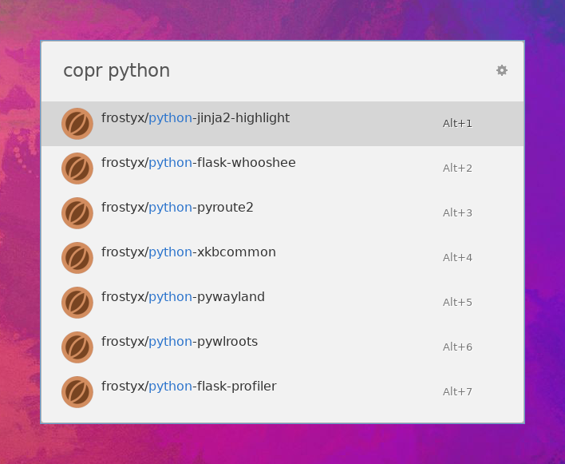

# Ulauncher Copr

An [Ulauncher][ulauncher] extension to open [Copr][copr] projects in the web
browser.


## Screenshot




## Dependencies

Please make sure you have the `copr` Python package installed.
On Fedora, it is recommended to run:

```
sudo dnf install python3-copr
```

Use an appropriate alternative for your distribution, or install the package
from PyPI

```
pip install --user copr
```


## Installation

1. Open Ulauncher preferences
2. Switch to the "Extensions" tab
3. Click "Add extension" on the left
4. Paste the url: https://github.com/FrostyX/ulauncher-copr
5. Click "Add"


[ulauncher]: https://ulauncher.io/
[copr]: https://copr.fedorainfracloud.org/
